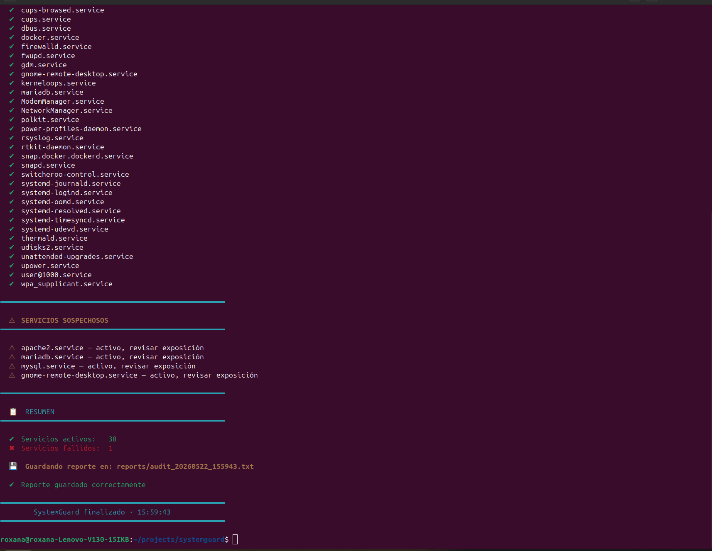

# 🛡️ SystemGuard — Linux Service Auditor

<div align="center">


**[🇪🇸 Español](#español) · [🇬🇧 English](#english)**

</div>

---

## 🇪🇸 Español <a name="español"></a>

### ¿Qué es SystemGuard?

SystemGuard es una herramienta de auditoría de servicios Linux desarrollada en Bash. Analiza en tiempo real el estado de los servicios del sistema usando `systemd` y `systemctl`, detectando servicios activos, fallidos y potencialmente sospechosos desde el punto de vista de la seguridad.

Desarrollado como proyecto práctico durante el aprendizaje de Linux y ciberseguridad.

### ✨ Características

- ✖ **Detección de servicios fallidos** — identifica servicios con errores en el sistema
- ✔ **Inventario de servicios activos** — lista completa de lo que está corriendo
- ⚠ **Detección de servicios sospechosos** — alerta sobre servicios que pueden suponer un riesgo (Apache, MariaDB, escritorio remoto, FTP, Telnet...)
- 📋 **Generación de reportes** — guarda automáticamente un reporte `.txt` con timestamp
- 🎨 **Salida con colores** — output visual claro en terminal

### 🚀 Instalación y uso

```bash
# Clona el repositorio
git clone https://github.com/roxana/systemguard.git
cd systemguard

# Da permisos de ejecución
chmod +x systemguard.sh

# Ejecuta la auditoría
./systemguard.sh
```

### 📁 Estructura del proyecto

```
systemguard/
├── systemguard.sh       # Script principal
├── reports/             # Reportes generados automáticamente
├── logs/                # Logs del sistema
├── README.md            # Documentación
└── .gitignore
```

### 📋 Ejemplo de output

```
  ✖  SERVICIOS FALLIDOS
  ━━━━━━━━━━━━━━━━━━━━━━━━━━━━━━━━━━━━━━━━
  ✖  vboxdrv.service

  ⚠  SERVICIOS SOSPECHOSOS
  ━━━━━━━━━━━━━━━━━━━━━━━━━━━━━━━━━━━━━━━━
  ⚠  apache2.service — activo, revisar exposición
  ⚠  mariadb.service — activo, revisar exposición
  ⚠  gnome-remote-desktop.service — activo, revisar exposición

  📋  RESUMEN
  ━━━━━━━━━━━━━━━━━━━━━━━━━━━━━━━━━━━━━━━━
  ✔  Servicios activos:   38
  ✖  Servicios fallidos:  1
  💾  Reporte guardado en: reports/audit_20260522_155943.txt
```

### 🛠️ Tecnologías

- **Bash scripting** — lógica del script
- **systemd / systemctl** — consulta de servicios
- **awk** — procesamiento de texto
- **Linux Ubuntu 24.04 LTS**

### 📚 Contexto de aprendizaje

Este proyecto forma parte de mi ruta de aprendizaje hacia **DevSecOps y Ciberseguridad**:

- 🟡 KodeKloud — DevOps Engineer
- 🔵 TryHackMe — Pre-Security y Fundamentos Web
- 🔴 HackTheBox Academy — Ruta Penetration Tester (→ CPTS)
- 🏛️ Especialización en Ciberseguridad — Cámara de Comercio de Sevilla *(Sep 2025)*

### 🔮 Próximas mejoras

- [ ] Módulo de auditoría de puertos abiertos con `ss` y `netstat`
- [ ] Alertas por correo cuando se detectan servicios sospechosos
- [ ] Modo silencioso para ejecutar como cron job
- [ ] Dashboard web con los resultados
- [ ] Soporte para múltiples hosts remotos vía SSH

---

## 🇬🇧 English <a name="english"></a>

### What is SystemGuard?

SystemGuard is a Linux service auditing tool written in Bash. It analyzes system service status in real time using `systemd` and `systemctl`, detecting active, failed, and potentially suspicious services from a security perspective.

Developed as a hands-on project while learning Linux and cybersecurity fundamentals.

### ✨ Features

- ✖ **Failed service detection** — identifies services with errors
- ✔ **Active service inventory** — full list of running services
- ⚠ **Suspicious service detection** — alerts on potentially risky services (Apache, MariaDB, remote desktop, FTP, Telnet...)
- 📋 **Automatic report generation** — saves a timestamped `.txt` report
- 🎨 **Color-coded output** — clear visual output in terminal

### 🚀 Installation & Usage

```bash
# Clone the repository
git clone https://github.com/roxana/systemguard.git
cd systemguard

# Make executable
chmod +x systemguard.sh

# Run the audit
./systemguard.sh
```

### 📁 Project Structure

```
systemguard/
├── systemguard.sh       # Main script
├── reports/             # Auto-generated audit reports
├── logs/                # System logs
├── README.md            # Documentation
└── .gitignore
```

### 🛠️ Tech Stack

- **Bash scripting** — core script logic
- **systemd / systemctl** — service querying
- **awk** — text processing
- **Linux Ubuntu 24.04 LTS**

### 📚 Learning Context

This project is part of my learning path towards **DevSecOps and Cybersecurity**:

- 🟡 KodeKloud — DevOps Engineer
- 🔵 TryHackMe — Pre-Security & Web Fundamentals
- 🔴 HackTheBox Academy — Penetration Tester path (→ CPTS)
- 🏛️ Cybersecurity Specialization — Chamber of Commerce, Seville *(Sep 2025)*

### 🔮 Upcoming Features

- [ ] Open port auditing module with `ss` and `netstat`
- [ ] Email alerts when suspicious services are detected
- [ ] Silent mode for running as a cron job
- [ ] Web dashboard for results visualization
- [ ] Multi-host support via SSH

---

<div align="center">

Made with 🐧 by **Roxana** · [Portfolio](https://roxana.dev) · [LinkedIn](#)

</div>
